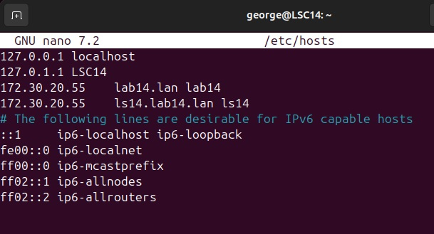
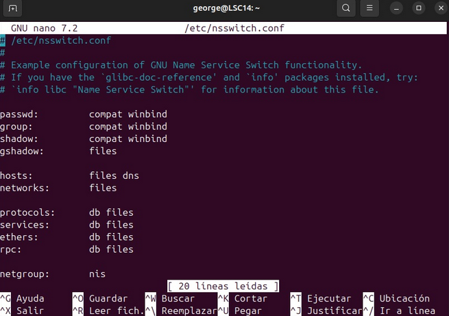

# Guía de Configuración de Ubuntu Server y Unión de Clientes Ubuntu y Windows al Dominio
## INTERNAL NET
Edit netplan, add interface

## SERVER CONFIGURATION

### Change hostname<br>
`sudo hostnamectl set-hostname ls14`

### Modify file hosts <br>

`sudo nano /etc/hosts`<br>
172.30.20.55 ls14.lab14.lan ls14

<p align="center">
  
</p>

<p align="center">
  <em>etc_hosts</em>
</p>

### Verify the FQDN<br>
`hostname -f`

### Verify if the FQDN is able to solv the Samba Ip address<br>
`ping -c2 ls14.lab14.lan`

### Disable systemd-resolved<br>
`sudo systemctl disable --now systemd-resolved`

### eliminate and unlink /etc/resolv.conf<br>
`sudo unlink /etc/resolv.conf`

### Create the new file /etc/resolv.conf<br>
`sudo nano /etc/resolv.conf`

### We add the next lines:<br>
nameserver 172.30.20.55<br>
nameserver 8.8.8.8<br>
search lab14.lan<br>

<p align="center">
  
</p>

<p align="center">
  <em>Resolv_conf</em>
</p>

### We make the /etc/resolv.conf file immutable so it cannot be changed.<br>
`sudo chattr +i /etc/resolv.conf`<br>

<p align="center">
  
</p>

<p align="center">
  <em>Netplan_Server</em>
</p>
<br>

## SAMBA INSTALL

### Update the package index<br>
`sudo apt update`

### Install Samba with its packages and dependencies<br>
`sudo apt install -y acl attr samba samba-dsdb-modules samba-vfs-modules smbclient winbind libpam-winbind libnss-winbind libpam-krb5 krb5-config krb5-user dnsutils chrony net-tools`

LAB14.LAN<br>
ls14.lab14.lan<br>
ls14.lab14.lan

### Stop and disable the services that the Samba Active Directory server does not require  (smbd, nmbd y winbind)<br>
`sudo systemctl disable --now smbd nmbd winbind`

### The server only needs samba-ac-dc to function as an Active Directory and controller domain.<br>
`sudo systemctl unmask samba-ad-dc`<br>
`sudo systemctl enable samba-ad-dc`

## SAMBA ACTIVE DIRECTORY CONFIGURATION

### Create a backup of /etc/samba/smb.conf<br>
`sudo mv /etc/samba/smb.conf /etc/samba/smb.conf.orig`

### Run the samba-tool command to begin provisioning Samba Active Directory.<br>
`sudo samba-tool domain provision`

Realm: LAB14.LAN<br>
Domain: LAB14<br>
Server Role: dc<br>
DNS backend: SAMBA_INTERNAL<br>
DNS forwarder IP address: 8.8.8.8<br>

### Create a backup of the default Kerberos configuration.<br>
`sudo mv /etc/krb5.conf /etc/krb5.conf.orig`

### Replace with the file /var/lib/samba/private/krb5.conf.<br>
`sudo cp /var/lib/samba/private/krb5.conf /etc/krb5.conf`

### Start Samba Active Directory service samba-ad-dc<br>
`sudo systemctl start samba-ad-dc`

### Test service<br>
`sudo systemctl status samba-ad-dc`<br>

<p align="center">
  
</p>

<p align="center">
  <em>Samba_file</em>
</p>

## SETTING TIME SYNCHRONIZATION<br>

Samba Active Directory relies on the Kerberos protocol, and Kerberos requires
that the times of the AD server and the workstation be synchronized.

To ensure proper time synchronization, we must also configure a network Time
Protocol (NTP) server in Samba.

### Change the default permissions and ownership of the /var/lib/samba/ntp_signd/ntp_signed. The chrony user/group must have read permissions in the ntp_signed.<br>
`sudo chown root:_chrony /var/lib/samba/ntp_signd/`<br>
`sudo chmod 750 /var/lib/samba/ntp_signd/`

### Modify the /etc/chrony/chrony.conf configuration file to enable the chrony NTP server and point the NTP socket location to /var/lib/samba/ntp_signd.<br>
`sudo nano /etc/chrony/chrony.conf`

bindcmdaddress 172.30.20.55<br>
allow 172.30.20.0/24<br>
ntpsigndsocket /var/lib/samba/ntp_signd

<p align="center">
  
</p>

<p align="center">
  <em>Chrony</em>
</p>


### Restart and verify the chronyd service on the Samba AD server.<br>
`sudo systemctl restart chronyd`<br>
`sudo systemctl status chronyd`


## VERIFY SAMBA ACTIVE DIRECTORY<br>


### Verify domain names<br>
`host -t A lab14.lan`<br>
`host -t A ls14.lab14.lan`<br>


### Verify that the Kerberos and LDAP service records point to the FQDN of your Samba Active Directory server<br>
`host -t SRV _kerberos._udp.lab14.lan`<br>
`host -t SRV _ldap._tcp.lab14.lan`


### Verify the default resources available in Samba Active Directory.<br>
`smbclient -L lab14.lan -N`


### Verify authentication on the Kerberos server using the user manager<br>
`kinit administrator@LAB14.LAN`<br>
`klist`


### Log in to the server via SMB<br>
`sudo smbclient //localhost/netlogon -U 'administrator'`


### Change the administrator user password<br>
`sudo samba-tool user setpassword administrator`


### Verify the integrity of the Samba configuration file.<br>
`testparm`


### Verify the operation of Windows Active Directory Domain Controller 2008<br>
`sudo samba-tool domain level show`


### Create user SAMBA AD<br>
`sudo samba-tool user create George`


### List SAMBA AD users<br>
`sudo samba-tool user list`


### Delete a user<br>
`samba-tool user delete <nombre_del_usuario>`


### List SAMBA AD computers<br>
`sudo samba-tool computer list`


### Delete SAMBA AD computer<br>
`sudo samba-tool computer delete <nombre_del_equipo>`


### Create a group<br>
`samba-tool group add <nombre_del_grupo>`


### List groups<br>
`samba-tool group list`


### List group members<br>
`samba-tool group listmembers 'Domain Admins'`


### Add a member to a group<br>
`samba-tool group addmembers <nombre_del_grupo> <nombre_del_usuario>`


### Remove a member from a group<br>
`samba-tool group removemembers <nombre_del_grupo> <nombre_del_usuario>`

### Create a OU

`samba-tool ou create "OU=NombreOU"`

### Create a user inside the OU

`samba-tool user create George2 --userou="OU=Usuarios"`

# IMPORTANT<<<<

##There is a way to do the things right

`samba-tool group add GG_Usuarios`<br>
`samba-tool group add GG_TI`<br>
`samba-tool group add DL_Share_Contabilidad`

### Move groups to their OU's

`samba-tool group move GG_TI "OU=Grupos"`

### Create the users

`samba-tool user create juan`
`samba-tool user move juan "OU=Usuarios"`

### Join the users to the groups

`samba-tool group addmembers GG_TI juan`<br>
`samba-tool group addmembers DL_Share_Contabilidad juan`

### Share directories

`mkdir -p /srv/samba/contabilidad`<br>
`chown root:"DL_Share_Contabilidad" /srv/samba/contabilidad`<br>
`chmod 2770 /srv/samba/contabilidad`

### Changes on smb.conf

What does your section in smb.conf do?
[Contabilidad]

path = /srv/samba/contabilidad
read only = no
valid users = @DL_Share_Contabilidad

[Contabilidad] → the name of the shared resource that clients will see.

path = /srv/samba/contabilidad → the physical folder in Ubuntu.

read only = no → allows writing (if set to yes, it would be read-only).

valid users = @DL_Share_Contabilidad → only users who are members of the DL_Share_Accounting group can access it.

**Note: The @ symbol before the group is required to indicate that it is a group and not a user.**

## File System Permissions

### Samba respects Linux permissions, so you must also do the following:

`chown root:DL_Share_Accounting /srv/samba/accounting`<br>
`chmod 2770 /srv/samba/accounting`

chown root:group → the group owner.

chmod 2770 → permissions:

2 → inherits group on new folders/files

7 → owner can read/write/execute

7 → group can read/write/execute

0 → others have no access

## Restart Samba

After editing smb.conf:

`systemctl restart smbd`

# Share folders (steps)

`sudo mkdir -p /srv/samba/Compartido`

File System Permissions

### We'll use a Samba group to control access.

Let's assume the group is called DL_Compartido:

`sudo groupadd DL_Compartido # if it doesn't exist`<br>
`sudo chown root:DL_Compartido /srv/samba/Compartido`<br>
`sudo chmod 2770 /srv/samba/Compartido`

2770 → owner and group can read/write, others cannot.

2 → makes new files inherit the group.

## Configuring the Share in Samba

Edit /etc/samba/smb.conf and add the following to the end:

`[Compartido]
path = /srv/samba/Compartido
read only = no
valid users = @DL_Compartido`

@DL_Compartido → all members of the group have access.

## Then Samba reload:

`sudo systemctl restart smbd`

# Trust
Be sure both servers were created with:

`samba-tool domain provision`

You can check that with:

`samba -V`

Test network
ping ls13.lab13.lan
ping ls14.lab14.lan

Test DNS
host ls13.lab13.lan
host ls14.lab14.lan

If DNS fails, we must configure BIND or Samba internal DNS.

Edit smb.conf adding:
dns forwarder = <ip of the other server>

on /etc/resolv.conf each server must contain local DNS server

nameserver 127.0.0.1
search lab14.lan

# Create a trust

`samba-tool domain trust create lab13.lan --type=external --direction=both -U"LAB13\Administrator"`

## Verify the trust with:

`samba-tool domain trust list`

### Most common problems

| Problem           | Fix                                   |
|-------------------|---------------------------------------|
| DNS not resolving | Fix `/etc/resolv.conf` or Samba DNS   |
| Time mismatch     | Sync with `ntp` or `chrony`           |
| Firewall          | Open ports: 53, 88, 135, 389, 445     |


### Files you may need to check

### On Ubuntu, these are the important ones:

| File                   | Purpose                          |
|------------------------|----------------------------------|
| /etc/hosts             | Static name resolution (optional)|
| /etc/resolv.conf       | DNS configuration                |
| /etc/samba/smb.conf    | Samba domain configuration       |


`kdestroy`<br>
`kinit Administrator@LAB14.LAN`

Enter the password for LAB14.

Check:

`klist`

#### It should show:

Default primary: Administrator@LAB14.LAN

## Create the trust (WITHOUT --admin)

Now run the following command exactly:

`samba-tool domain trust create lab14.lan

--type=external

--direction=both`

### Samba will use the active Kerberos ticket

Note <<<<<<
If it fails: Quick Kerberos test:<br>
`kvno cifs/ls14.lab14.lan`

If it returns a number → Kerberos OK.

## (automatic)

Samba will then ask for the local domain credentials if needed.

### Expected result
Creating trust with domain 'lab14.lan'
Trust created successfully

# Make-your-Ubuntu-Server-a-functional-router

### Modify file *unmute line net.ipv4.ip.forward=1*
`sudo nano /etc/sysctl.conf`

### Apply modication
`sudo sysctl -p /etc/sysctl.conf`

### Test
`sudo cat /proc/sys/net/ipv4/ip_forward`

### Test iptables<br>
`sudo iptables -L`<br>

*Note: If there is no Input, Output or Fordward then execute*<br>

`sudo iptables -P FORWARD ACCEPT`

### Enrouting
`sudo iptables -t nat -A POSTROUTING -o enp0s3 -j MASQUERADE`


## UBUNTU CLIENT CONFIGURATION


### Change hostname<br>
`sudo hostnamectl set-hostname LSC14`<br>
`hostname -f`


### Configure the /etc/hosts file<br>
`sudo nano /etc/hosts`

172.30.20.55     lab14.lan lab14<br>
172.30.20.55     ls14.lab14.lan ls14<br>

<p align="center">
  
</p>

<p align="center">
  <em>etc_hosts</em>
</p>

### Check connectivity<br>
`ping -c2 lab14.lan`


### Install NTPDATE<br>
`sudo apt-get install ntpdate`<br>
`sudo ntpdate -q lab14.lan`<br>
`sudo ntpdate lab14.lan`<br>


### Install required packages<br>
`sudo apt-get install samba krb5-config krb5-user winbind libpam-winbind libnss-winbind`<br>

LAB14.LAN<br>
ls14.lab14.lan<br>
ls14.lab14.lan<br>


### Verify authentication on the Kerberos server using the user administrator<br>
`kinit administrator@LAB14.LAN`<br>
`klist`<br>


### Move smb.conf file and create a backup<br>
`mv /etc/samba/smb.conf /etc/samba/smb.conf.initial`


### Create an empty smb.conf file<br>
`nano /etc/samba/smb.conf`

[global]<br>
        workgroup = LAB14<br>
        realm = LAB14.LAN<br>
        netbios name = LSC14<br>
        security = ADS<br>
        dns forwarder = 172.30.20.55<br>

idmap config * : backend = tdb<br>
idmap config *:range = 50000-1000000<br>

   template homedir = /home/%D/%U<br>
   template shell = /bin/bash<br>
   winbind use default domain = true<br>
   winbind offline logon = false<br>
   winbind nss info = rfc2307<br>
   winbind enum users = yes<br>
   winbind enum groups = yes<br>

  vfs objects = acl_xattr<br>
  map acl inherit = Yes<br>
  store dos attributes = Yes<br>

<p align="center">
  
</p>

<p align="center">
  <em>smb_conf</em>
</p>

### Restart all Samba daemons<br>
`sudo systemctl restart smbd nmbd`


### Stop unnecessary services<br>
`sudo systemctl stop samba-ad-dc`


### Enable Samba services<br>
`sudo systemctl enable smbd nmbd`


### Join Ubuntu Desktop to SAMBA AD DC<br>
`sudo net ads join -U administrator`


### List SAMBA AD computers<br>
`sudo samba-tool computer list`


## CONFIGURE AD ACCOUNT AUTHENTICATION<br>

### Edit the Name Service Switch (NSS) configuration file<br>
`sudo nano /etc/nsswitch.conf`

passwd:       compat winbind<br>
group:        compat winbind<br>
shadow:       compat winbind<br>
hosts:        files dns<br>

<p align="center">
  
</p>

<p align="center">
  <em>nsswitch_conf</em>
</p>

### Restart the Winbind service<br>
`sudo systemctl restart winbind`

### Check if Ubuntu Desktop was integrated into the domain<br>
`wbinfo -u`<br>
`wbinfo -g`<br>

### Verify the Winbind NSS module using the getent command<br>
`sudo getent passwd | grep administrator`<br>
`sudo getent group | grep 'domain admins'`<br>
`id administrator`<br>

### Configure pam-auth-update to authenticate with domain accounts and automatically create home directories<br>
`sudo pam-auth-update`

### Edit the /etc/pam.d/common-account file to automatically create home directories<br>
`nano /etc/pam.d/common-account`

### Add the following at the end of the file:<br>

session    required    pam_mkhomedir.so    skel=/etc/skel/    umask=0022

<p align="center">
  
</p>

<p align="center">
  <em>common_account</em>
</p>

### Authenticate with a Samba4 AD account<br>
`su administrator`

<p align="center">
  
</p>

<p align="center">
  <em>su_administrator</em>
</p>

### Add domain account with root privileges<br>
`sudo usermod -aG sudo administrator`

### Authenticate via GUI<br>
`administrator@lab14.lan`

## Create shared folders

`sudo mkdir -p /srv/compartido`

### Asign domain group:

### is there's a group named Ventas:

`sudo chown root:"MIDOMINIO\Ventas" /srv/compartido`<br>
`sudo chmod 2770 /srv/compartido`

### Create the shared resource in Samba

**Edit:**

`sudo nano /etc/samba/smb.conf`

**Add at the end:**

[Compartido]<br>
   path = /srv/compartido<br>
   read only = no<br>
   browsable = yes<br>
   valid users = @MIDOMINIO\Ventas


**Reboot:**

`sudo systemctl restart smbd`

### Try from one client

***In a windows client:***

`\\IP_DEL_SERVIDOR\Compartido`

**O:**

`\\servidor\Compartido`

### Optional: allow advanced ACL 

### Install:

`sudo apt install acl`

**Mount with ACL (if necessary):**

`sudo setfacl -m g:"MIDOMINIO\Ventas":rwx /srv/compartido`

### Useful diagnostic commands

**View domain status:**

`net ads testjoin`

**Watch information about the domain:**

`net ads info`

**See users:**

`wbinfo -u`

**See groups:**

`wbinfo -g`

## Train Process

**With this filter the process**<br>
`pgrep -a sl`

**To stop and restart the process**<br>
```
kill -19 PID
kill -18 PID
```

