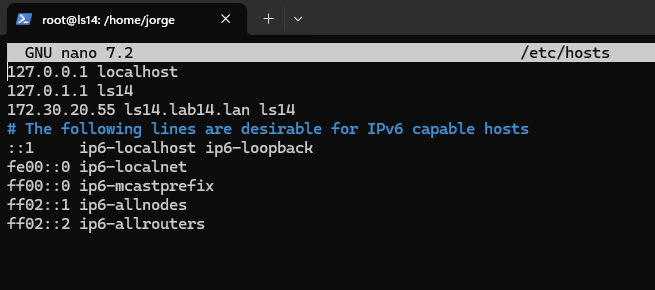
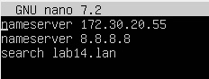
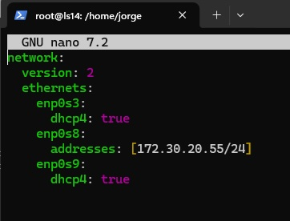
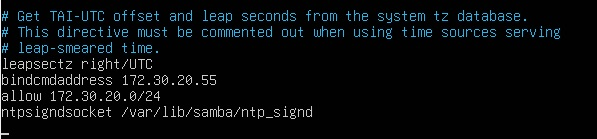
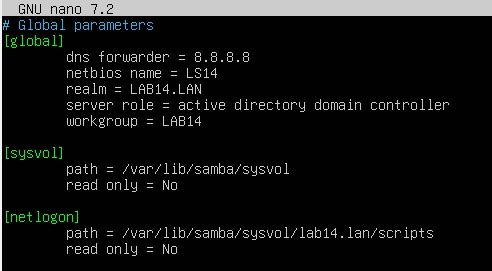
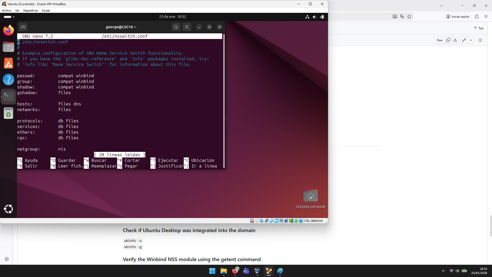
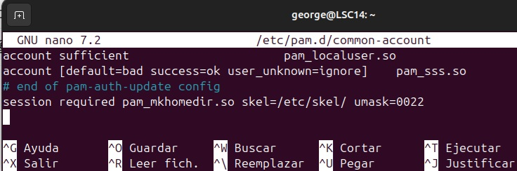

# Guía de Configuración de Ubuntu Server y Unión de Clientes Ubuntu y Windows al Dominio

## SERVER CONFIGURATION

### Change hostname 
`sudo hostnamectl set-hostname ls14`

### Modify file hosts  

`sudo nano /etc/hosts` 
172.30.20.55 ls14.lab14.lan ls14

  

  <em>etc_hosts</em>

### Verify the FQDN 
`hostname -f`

### Verify if the FQDN is able to solv the Samba Ip address 
`ping -c2 ls14.lab14.lan`

### Disable systemd-resolved 
`sudo systemctl disable --now systemd-resolved`

### eliminate and unlink /etc/resolv.conf 
`sudo unlink /etc/resolv.conf`

### Create the new file /etc/resolv.conf 
`sudo nano /etc/resolv.conf`

### We add the next lines: 
nameserver 172.30.20.55 
nameserver 8.8.8.8 
search lab14.lan 

  

  <em>Resolv_conf</em>

### We make the /etc/resolv.conf file immutable so it cannot be changed. 
`sudo chattr +i /etc/resolv.conf` 

  

  <em>Netplan_Server</em>

 

## SAMBA INSTALL

### Update the package index 
`sudo apt update`

### Install Samba with its packages and dependencies 
`sudo apt install -y acl attr samba samba-dsdb-modules samba-vfs-modules smbclient winbind libpam-winbind libnss-winbind libpam-krb5 krb5-config krb5-user dnsutils chrony net-tools`

LAB14.LAN 
ls14.lab14.lan 
ls14.lab14.lan

### Stop and disable the services that the Samba Active Directory server does not require  (smbd, nmbd y winbind) 
`sudo systemctl disable --now smbd nmbd winbind`

### The server only needs samba-ac-dc to function as an Active Directory and controller domain. 
`sudo systemctl unmask samba-ad-dc` 
`sudo systemctl enable samba-ad-dc`

## SAMBA ACTIVE DIRECTORY CONFIGURATION

### Create a backup of /etc/samba/smb.conf 
`sudo mv /etc/samba/smb.conf /etc/samba/smb.conf.orig`

### Run the samba-tool command to begin provisioning Samba Active Directory. 
`sudo samba-tool domain provision`

Realm: LAB14.LAN 
Domain: LAB14 
Server Role: dc 
DNS backend: SAMBA_INTERNAL 
DNS forwarder IP address: 8.8.8.8 

### Create a backup of the default Kerberos configuration. 
`sudo mv /etc/krb5.conf /etc/krb5.conf.orig`

### Replace with the file /var/lib/samba/private/krb5.conf. 
`sudo cp /var/lib/samba/private/krb5.conf /etc/krb5.conf`

### Start Samba Active Directory service samba-ad-dc 
`sudo systemctl start samba-ad-dc`

### Test service 
`sudo systemctl status samba-ad-dc` 

  

  <em>Samba_file</em>

## SETTING TIME SYNCHRONIZATION 

Samba Active Directory relies on the Kerberos protocol, and Kerberos requires
that the times of the AD server and the workstation be synchronized.

To ensure proper time synchronization, we must also configure a network Time
Protocol (NTP) server in Samba.

### Change the default permissions and ownership of the /var/lib/samba/ntp_signd/ntp_signed. The chrony user/group must have read permissions in the ntp_signed. 
`sudo chown root:_chrony /var/lib/samba/ntp_signd/` 
`sudo chmod 750 /var/lib/samba/ntp_signd/`

### Modify the /etc/chrony/chrony.conf configuration file to enable the chrony NTP server and point the NTP socket location to /var/lib/samba/ntp_signd. 
`sudo nano /etc/chrony/chrony.conf`

bindcmdaddress 172.30.20.55 
allow 172.30.20.0/24 
ntpsigndsocket /var/lib/samba/ntp_signd

  

  <em>Chrony</em>

### Restart and verify the chronyd service on the Samba AD server. 
`sudo systemctl restart chronyd`
`sudo systemctl status chronyd`

## VERIFY SAMBA ACTIVE DIRECTORY 

### Verify domain names 
`host -t A ls14.lab14.lan` 
`host -t A ls14.lab14.lan` 

### Verify that the Kerberos and LDAP service records point to the FQDN of your Samba Active Directory server 
`host -t SRV _kerberos._udp.lab14.lan` 
`host -t SRV _ldap._tcp.lab14.lan`

### Verify the default resources available in Samba Active Directory. 
`smbclient -L lab14.lan -N`

### Verify authentication on the Kerberos server using the user manager 
`kinit administrator@LAB14.LAN`
`klist`

### Log in to the server via SMB 
`sudo smbclient //localhost/netlogon -U 'administrator'`

### Change the administrator user password 
`sudo samba-tool user setpassword administrator`

### Verify the integrity of the Samba configuration file. 
`testparm`

### Verify the operation of Windows Active Directory Domain Controller 2008 
`sudo samba-tool domain level show`

### Create user SAMBA AD 
`sudo samba-tool user create George`

### List SAMBA AD users 
`sudo samba-tool user list`

### Delete a user 
`samba-tool user delete <nombre_del_usuario>`

### List SAMBA AD computers 
`sudo samba-tool computer list`

### Delete SAMBA AD computer 
`sudo samba-tool computer delete <nombre_del_equipo>`

### Create a group 
`samba-tool group add <nombre_del_grupo>`

### List groups 
`samba-tool group list`

### List group members 
`samba-tool group listmembers 'Domain Admins'`

### Add a member to a group 
`samba-tool group addmembers <nombre_del_grupo> <nombre_del_usuario>`

### Remove a member from a group 
`samba-tool group removemembers <nombre_del_grupo> <nombre_del_usuario>`

[https://github.com/u8542062435-boop/Make-your-Ubuntu-Server-a-functional-router](https://github.com)

## UBUNTU CLIENT CONFIGURATION

### Change hostname 
`sudo hostnamectl set-hostname LSC14`
`hostname -f`

### Configure the /etc/hosts file 
`sudo nano /etc/hosts`

192.168.1.8     lab14.lan lab14
192.168.1.8     ls14.lab14.lan ls14

### Check connectivity 
`ping -c2 lab14.lan`

### Install NTPDATE 
`sudo apt-get install ntpdate`
`sudo ntpdate -q lab14.lan`
`sudo ntpdate lab14.lan`

### Install required packages 
`sudo apt-get install samba krb5-config krb5-user winbind libpam-winbind libnss-winbind` 

LAB14.LAN 
ls14.lab14.lan 
ls14.lab14.lan 

### Verify authentication on the Kerberos server using the user administrator 
`kinit administrator@LAB14.LAN` 
`klist` 

### Move smb.conf file and create a backup 
`mv /etc/samba/smb.conf /etc/samba/smb.conf.initial`

### Create an empty smb.conf file 
`nano /etc/samba/smb.conf`

[global] 
        workgroup = LAB14 
        realm = LAB14.LAN 
        netbios name = LSC14 
        security = ADS 
        dns forwarder = 172.30.20.55 

idmap config * : backend = tdb 
idmap config *:range = 50000-1000000 

   template homedir = /home/%D/%U 
   template shell = /bin/bash 
   winbind use default domain = true 
   winbind offline logon = false 
   winbind nss info = rfc2307 
   winbind enum users = yes 
   winbind enum groups = yes 

  vfs objects = acl_xattr 
  map acl inherit = Yes 
  store dos attributes = Yes 

  

  <em>smb_conf</em>

### Restart all Samba daemons 
`sudo systemctl restart smbd nmbd`

### Stop unnecessary services 
`sudo systemctl stop samba-ad-dc`

### Enable Samba services 
`sudo systemctl enable smbd nmbd`

### Join Ubuntu Desktop to SAMBA AD DC 
`sudo net ads join -U administrator`

### List SAMBA AD computers 
`sudo samba-tool computer list`

## CONFIGURE AD ACCOUNT AUTHENTICATION 

### Edit the Name Service Switch (NSS) configuration file 
`sudo nano /etc/nsswitch.conf`

passwd:       compat winbind 
group:        compat winbind 
shadow:       compat winbind 
hosts:        files dns 

  

  <em>nsswitch_conf</em>

### Restart the Winbind service 
`sudo systemctl restart winbind`

### Check if Ubuntu Desktop was integrated into the domain 
`wbinfo -u` 
`wbinfo -g` 

### Verify the Winbind NSS module using the getent command 
`sudo getent passwd | grep administrator` 
`sudo getent group | grep 'domain admins'` 
`id administrator` 

### Configure pam-auth-update to authenticate with domain accounts and automatically create home directories 
`sudo pam-auth-update`

### Edit the /etc/pam.d/common-account file to automatically create home directories 
`nano /etc/pam.d/common-account`

### Add the following at the end of the file: 

session    required    pam_mkhomedir.so    skel=/etc/skel/    umask=0022

  

  <em>common_account</em>

### Authenticate with a Samba4 AD account 
`su administrator`

  

  <em>su_administrator</em>

### Add domain account with root privileges 
`sudo usermod -aG sudo administrator`

### Authenticate via GUI 
`administrator@lab14.lan`
